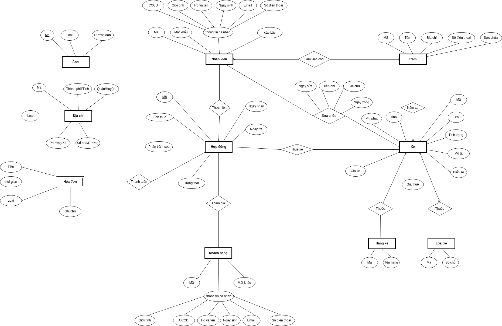
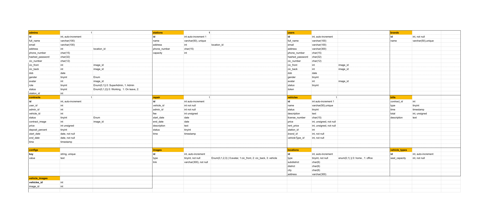

# Phân tích trang web quản lý cho thuê ô tô
### 1. Đối tượng sử dụng
- Quản trị viên
- Nhân viên
- Người dùng
### 2. Chức năng từng đối tượng
*A. Quản trị viên*
- Đăng nhập
- Quản lý trang thông tin 
- Quản lý nhân viên
- Quản lý người dùng
- Quản lý xe
- Quản lý trạm
- Duyệt phí sửa xe 
- Thống kê (doanh thu, chi phí,...)

*B. Nhân viên*
- Đăng nhập
- Duyệt hợp đồng cho thuê 
- Gửi yêu cầu sửa chữa xe và phụ phí
- Quản lý các xe trong trạm cụ thể
- Quản lý đặt xe của khách

*C. Người dùng*
- Đăng ký, Đăng nhập
- Tìm kiếm xe 
- Xem thông tin : lịch sử thuê, hóa đơn, …
- Đặt lịch thuê xe

### 3. Thông tin Cơ Sở Dữ Liệu
*A. Sơ đồ thực thể*
 

 
*B. Cơ sở dữ liệu*
 

